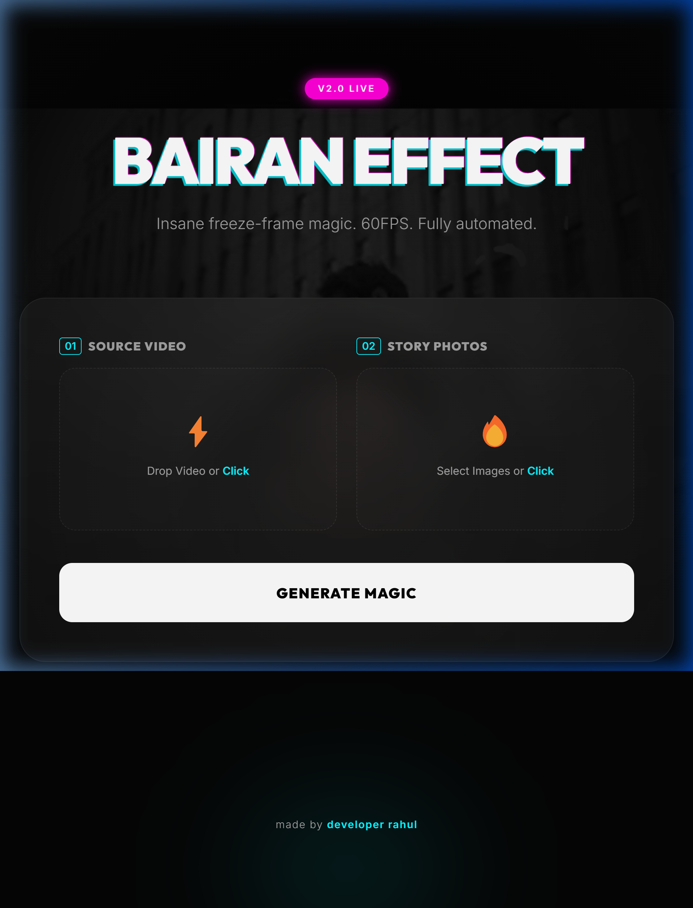
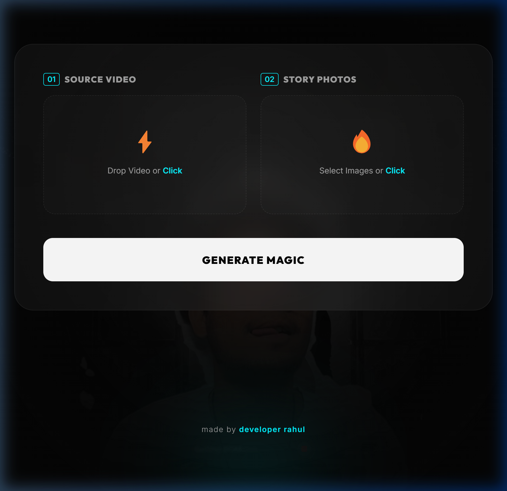

# Bairan Effect ⚡️✨

> **The Ultimate AI-Powered Freeze Frame Video Automation Engine.**



### 🎬 What is Bairan Effect?
Bairan Effect is a premium video automation tool designed to create high-impact, professional freeze-frame transitions at **60FPS**. Built with a modern GenZ aesthetic, it handles everything from AI background removal to complex 1080p video composition—all in one click.

---

### 💎 Key Features
- **🚀 60FPS High-Frame-Rate**: Buttery smooth animations and transitions.
- **🧠 Local AI BG Removal**: Zero API keys needed. Powered by `@imgly/background-removal-node`.
- **🎨 GenZ Brand Identity**: High-impact neon-dark UI with glassmorphism and video backgrounds.
- **🛡️ Concurrency Guard**: Built-in sequential processing queue for server stability.
- **🎵 Custom Audio Sync**: Integrated `barain.mp3` default background score.
- **🧹 Auto-Cleanup**: Periodic temporary file management to keep your server lean.

---

### 🛠️ Quick Start (Docker)

The fastest way to get Bairan Effect running is via Docker:

1. **Clone the Repo**
   ```bash
   git clone https://github.com/developerrahulofficial/Bairan-effect.git
   cd Bairan-effect
   ```

2. **Run with Docker Compose**
   ```bash
   docker-compose up -d --build
   ```

3. **Access the App**
   Open your browser and jump to: `http://localhost:3005`

---

### 🌐 Deploy Anywhere
Bairan Effect is cloud-ready. Deploy it to **Koyeb**, **Railway**, or **DigitalOcean** in minutes. 
*Note: We recommend at least 2GB of RAM for optimal AI processing.*

---

### 📸 UI Preview


---

### 👨‍💻 Developed By
**Rahul** (@developer_rahul_)



---

### 📜 License
MIT © [Rahul](https://www.instagram.com/developer_rahul_/)
